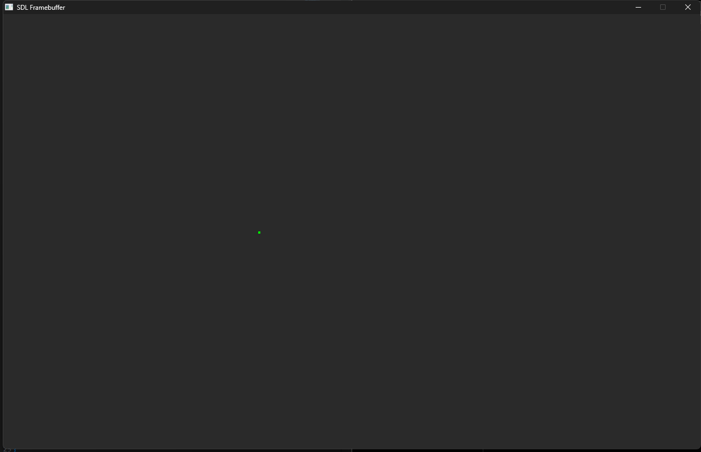
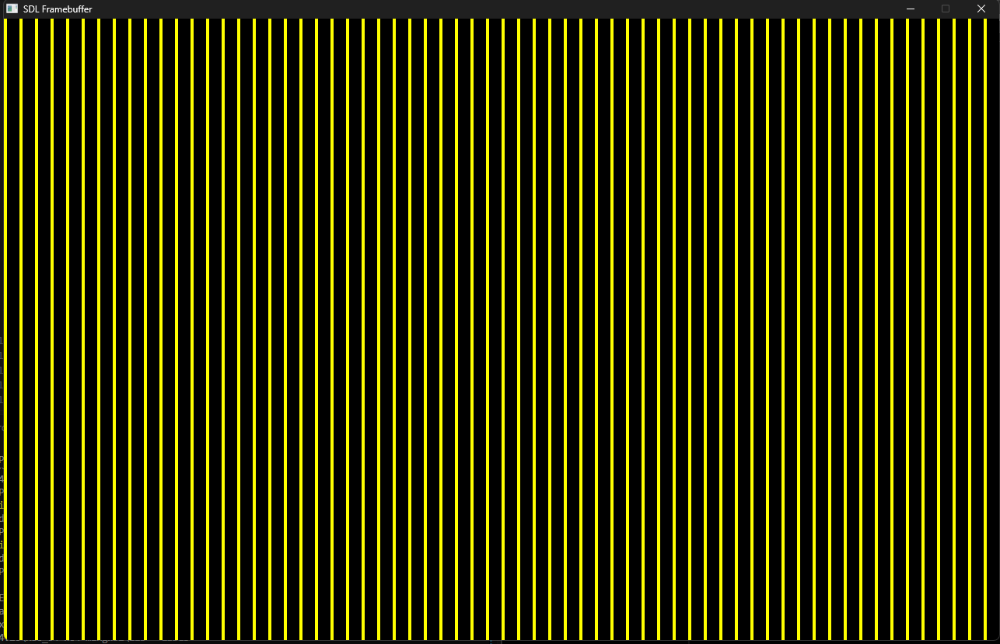
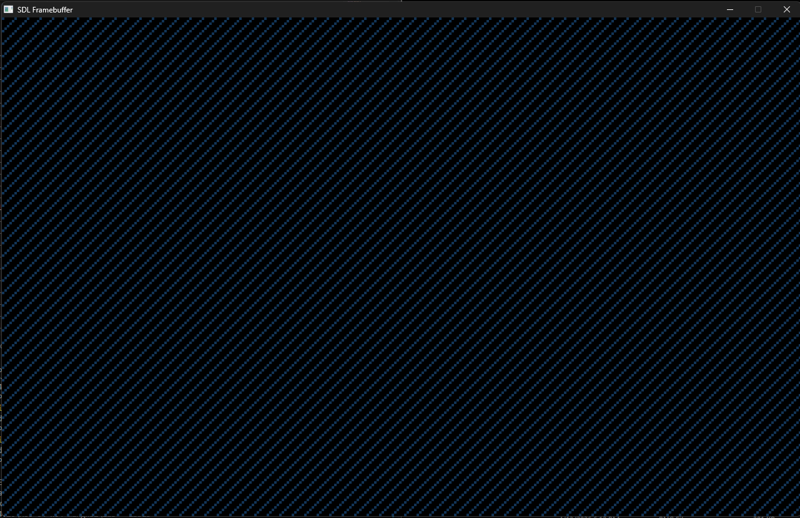

# FCC_LowLevelGraphics_In_C
Understanding how pixel manipulation works in C from the video "Low-Level Graphics in C – Pixel Manipulation and Frame Buffers" by Gustavo Pezzi at freecodecamp.org . 

Video link: https://www.youtube.com/watch?v=wDWKUvTKCaw

---

## Short Notice

Here i will cover the important aspects on the project/video related, but the whole other things and the research process is available in [INFORMATIONS.md](./INFORMATIONS.md)

---

  
  
  

---

## Rating
* Difficulty: 2/5
* Usefulness: 5/5 (because i think it's really important to know how graphics work on a low level, from event polls to textures and rendering) (after watching the video, one can go wild and experiment with the output of a single pixel to whole new things on their own)
* How hard it is to follow the tutorial: 2/5 (2 mostly because i knew some things already, but the shortness and compacted informations give a bonusw to the video) 

---

## After following the whole video

It's interesting seeing how Gustavo Pezzi puts into perspective low level graphics. 

In the past i've tried to do some visual projects in C and the first library i could find was SFML and I did a project where I made an array/vector sorting app in romanian [VectorSorting](https://github.com/MrRaven07/VectorSorting). I had access to more things than there are in SDL if i remember corectly (like circles and other primitives). I had to find some interesting shortcuts in order to make the vector project work as i intended which i think are similar to what I saw in the video (meaning, low level things related to graphics).

The video covers some interesting parts like:
- Screen Resolution vs Aspect Ratio
- Understanding the framebuffer and how can it be viewed as a 2D matrix
- The existence of cross-platform libraries that can output GUIs like SDL, GLFW, SFML, Allegro and Raylib
- What are the following parts in SDL: window, renderer, texture and framebuffer
- Proof of concept about what other things can be done with low level graphical tools (the DOOM fire effect)
- Capping the FPS to 60 (or any other number)
- The difference between software and hardware rendering
